# BMI Health Analyzer 🏋️‍♂️

## 📌 Project Context

This project/program was developed as part of the "Python for Computational Problem Solving" course in the 1st semester of B.Tech (Computer Science and Engineering) at PES University, RR Campus.
It was completed as part of the Jackfruit group assignment.

A comprehensive BMI (Body Mass Index) calculator and health analysis tool with both CLI and GUI interfaces, featuring AI-powered health suggestions and an interactive FAQ chatbot.

## 📋 Table of Contents

- [Features](#features)
- [Project Structure](#📁-project-structure)
- [Installation](#🚀-installation)
- [Configuration](#⚙️-configuration)
- [Usage](#📖-usage)
- [Modules Overview](#🧩-modules-overview)
- [API Integration](#🤖-api-integration)
- [Running Tests](#🧪-running-tests)
- [Screenshots](#📸-screenshots)
- [Development](#🛠️-development)
- [Disclaimer](#⚠️-disclaimer)
- [License](#📄-license)
- [Project Team](#👤-project-team)
- [Acknowledgments](#🙏-acknowledgments)
---

## Features ✨

### Core Functionality
- **BMI Calculation** - Calculate BMI with support for multiple unit systems:
  - Weight: kilograms (kg) or pounds (lb)
  - Height: meters (m), centimeters (cm), inches (in), or feet/inches (ft/in)
- **BMI Categorization** - WHO-standard classification:
  - Underweight (< 18.5)
  - Normal weight (18.5 - 24.9)
  - Overweight (25 - 29.9)
  - Obesity Class I (30 - 34.9)
  - Obesity Class II (35 - 39.9)
  - Obesity Class III (≥ 40)

### Health Metrics
- **BMR Calculation** - Basal Metabolic Rate using Mifflin-St Jeor formula
- **Water Intake Recommendation** - Daily water intake based on body weight
- **Healthy Weight Range** - Target weight range for your height
- **Weight Goals** - Kilograms to gain or lose to reach healthy BMI

### AI-Powered Features
- **AI Health Suggestions** - Personalized diet, exercise, and lifestyle recommendations powered by Google Gemini AI
- **AI FAQ Chatbot** - Ask health, diet, fitness, and BMI-related questions
- **Health Fact of the Day** - Daily health tips (AI-generated with static fallback)

### Visualization
- **BMI Comparison Graph** - Compare your BMI with world averages
- **Weight vs Healthy Range** - Visual comparison of current vs target weight
- **BMI Position Chart** - See where your BMI falls on the healthy range scale

### Data Management
- **Profile History** - Save and view past BMI calculations
- **JSON Storage** - Persistent data storage in `user_profiles.json`

---

## 📁 Project Structure

```
mini_bmi_project/
├── .gitignore                 # Git ignore rules
├── README.md                  # Project documentation
├── requirements.txt           # Python dependencies
├── user_profiles.json         # Saved user data (auto-generated)
├── assets/                    # Images and static assets
│   └── background.png         # GUI background image (optional)
├── screenshots/                # Application screenshots
├── src/
│   ├── .env                   # Environment variables (API keys)
│   ├── main.py                # Main entry point
│   ├── bmi_core.py            # Core BMI calculations
│   ├── bmi_cli.py             # Command-line interface
│   ├── bmi_gui2.py            # wxPython GUI application
│   ├── chatbot_ai.py          # AI integration (Google Gemini)
│   ├── suggestions.py         # Static health suggestions
│   ├── visualize.py           # Matplotlib visualizations
│   ├── data_utils.py          # Data persistence utilities
│   └── __pycache__/           # Python cache (ignored)
└── tests/
    └── test_bmi_core.py       # Unit tests for core module
```

---

## 🚀 Installation

### Prerequisites
- Python 3.9 or higher
- pip (Python package manager)

### Steps

1. **Clone the repository**
   ```bash
   git clone https://github.com/AAK1767/mini_bmi_project.git
   cd mini_bmi_project
   ```

2. **Create a virtual environment** (optional, but recommended)
   ```bash
   python -m venv venv
   
   # Windows
   venv\Scripts\activate
   
   # macOS/Linux
   source venv/bin/activate
   ```

3. **Install dependencies**
   ```bash
   pip install -r requirements.txt
   ```

### Dependencies
| Package | Version | Purpose |
|---------|---------|---------|
| wxPython | ≥ 4.2.0 | GUI framework |
| matplotlib | ≥ 3.7.0 | Data visualization |
| python-dotenv | ≥ 1.0.0 | Environment variable management |
| google-genai | ≥ 1.0.0 | Google Gemini AI integration |
| pytest | ≥ 9.0.0 | For testing the code |

---

## ⚙️ Configuration

### API Key Setup

To enable AI features, you need a Google Gemini API key:

1. Get an API key from [Google AI Studio](https://makersuite.google.com/app/apikey)

2. Create a `.env` file in the `src/` directory:
   ```env
   GEMINI_API_KEY=your_api_key_here
   ```

3. The application will automatically load the API key

> **Note:** AI features will gracefully fallback to static suggestions if the API key is missing or invalid.

---

## 📖 Usage

### Running the Application

Launch the BMI Health Analyzer:

```bash
cd src
python main.py
```

You will be presented with a menu to choose your preferred interface:

```
========================================
       BMI HEALTH ANALYZER
========================================

Choose your interface:
1. Command Line Interface (CLI)
2. Graphical User Interface (GUI)
3. Exit
```

**CLI Features:**
- Interactive text-based menus
- Health fact on startup
- BMI calculation, suggestions, FAQ, graphs, and history

**GUI Features:**
- **Calculator Tab** - Enter your details and calculate BMI
- **Suggestions Tab** - Get standard or AI-powered health suggestions
- **AI FAQ Tab** - Chat with the AI about health topics
- **History Tab** - View past calculations
- **Graphs Tab** - Visualize your BMI data

### Direct Module Usage

```python
from bmi_core import bmi_report

# Calculate BMI with metric units
result = bmi_report(
    weight=70,           # kg
    height=1.75,         # meters
    age=25,
    sex='male',
    weight_unit='kg',
    height_unit='m'
)

bmi, category, description, bmr, healthy_range, water, gain, lose = result
print(f"BMI: {bmi}, Category: {category}")
```

---

## 🧩 Modules Overview

### [`bmi_core.py`](src/bmi_core.py)
Core calculation engine containing:
- `calculate_bmi()` - BMI calculation with validation
- `bmi_category()` - WHO-standard categorization
- `calculate_bmr_mifflin()` - Basal Metabolic Rate
- `healthy_weight_range_for_height()` - Target weight range
- `recommended_water_liters_per_day()` - Water intake recommendation
- Unit conversion functions (`lb_to_kg`, `cms_to_meters`, etc.)

### [`chatbot_ai.py`](src/chatbot_ai.py)
AI integration module:
- `generate_bmi_suggestions()` - Personalized health recommendations
- `generate_bmi_faq_answer()` - FAQ chatbot responses
- `generate_health_fact_of_the_day()` - Daily health tips

### [`suggestions.py`](src/suggestions.py)
Static suggestion engine (fallback when AI unavailable):
- `health_facts()` - Category-specific health facts
- `exercise_plan()` - Exercise recommendations
- `diet_suggestions()` - Nutrition guidance
- `warnings()` - Health warnings for risky categories

### [`visualize.py`](src/visualize.py)
Matplotlib visualization functions:
- `plot_bmi_comparison()` - Bar chart comparing with world averages
- `plot_bmi_distribution()` - Pie chart of global BMI categories
- `plot_weight_vs_ideal()` - Current vs healthy weight comparison
- `plot_bmi_range()` - BMI position on healthy range scale

### [`data_utils.py`](src/data_utils.py)
Data persistence utilities:
- `load_profiles()` - Load saved user profiles
- `save_profile()` - Save calculation results
- `get_profiles()` - Retrieve all profiles

### [`bmi_gui2.py`](src/bmi_gui2.py)
wxPython GUI application with tabbed interface:
- Calculator, Suggestions, FAQ, History, and Graphs tabs
- Background image support
- Threaded AI calls for responsive UI

### [`bmi_cli.py`](src/bmi_cli.py)
Command-line interface with:
- Interactive menus
- Health fact on startup
- Fallback handling for AI failures

---

## 🤖 API Integration

### Google Gemini AI

The application uses Google's Gemini AI (model: `gemini-2.5-flash-lite`) for:

1. **Health Suggestions** - Structured JSON responses with:
   - Summary of BMI category
   - Exercise recommendations
   - Nutrition suggestions
   - Lifestyle advice
   - Optional cautions

2. **FAQ Responses** - Natural language answers about:
   - BMI and health metrics
   - Diet and nutrition
   - Exercise and fitness
   - General wellness

### Fallback Behavior

If AI is unavailable (no API key, network error, etc.):
- Suggestions fallback to rule-based static content from [`suggestions.py`](src/suggestions.py)
- Health facts fallback to predefined list
- Error messages are displayed to the user

---

## 🧪 Running Tests

```bash
cd tests
python -m pytest test_bmi_core.py -v
```

Or run directly:
```bash
python tests/test_bmi_core.py
```

---

## 📸 Screenshots

**Main menu – choose CLI or GUI**  
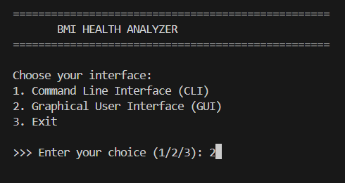

**CLI mode – BMI calculation**  
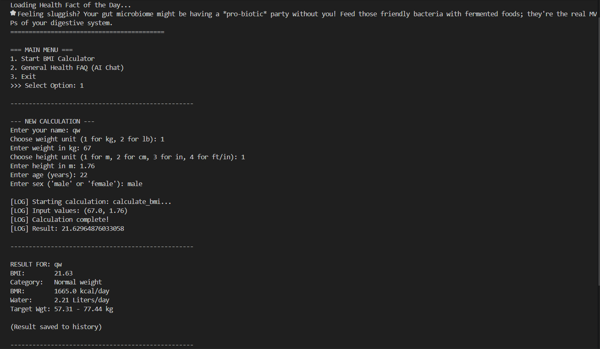

**GUI – normal BMI case**  
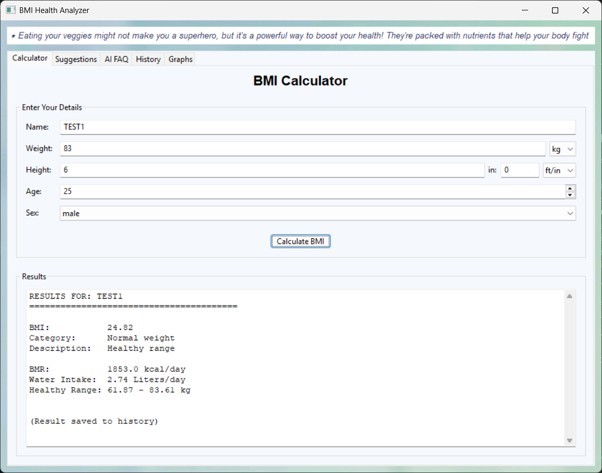

**GUI – underweight BMI case**  
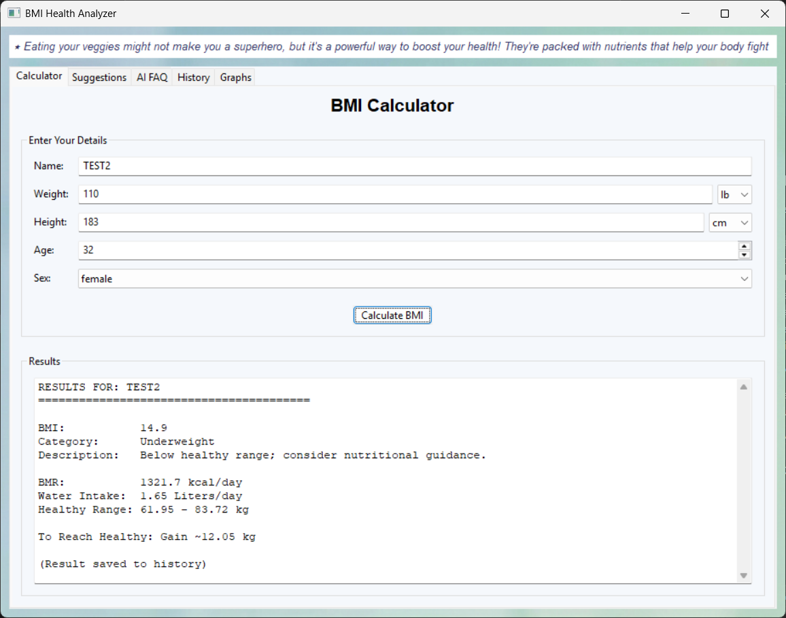

**AI-powered suggestions**  
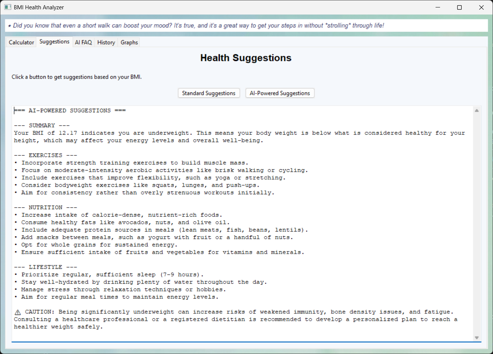

**AI FAQ chat**  
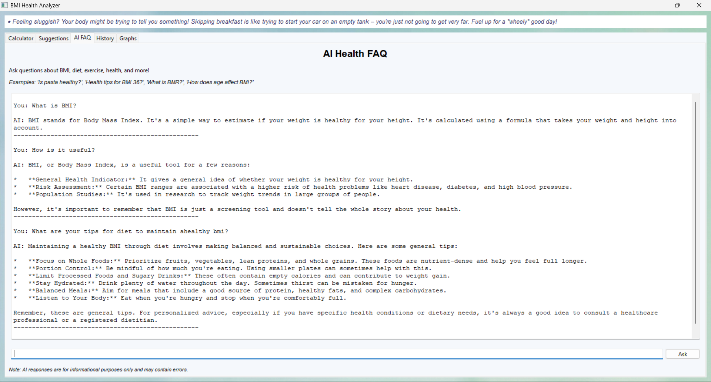

**BMI history table**  


**Graph selection menu**  
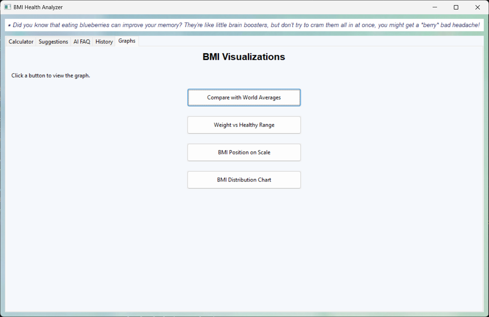

**World BMI comparison graph**  
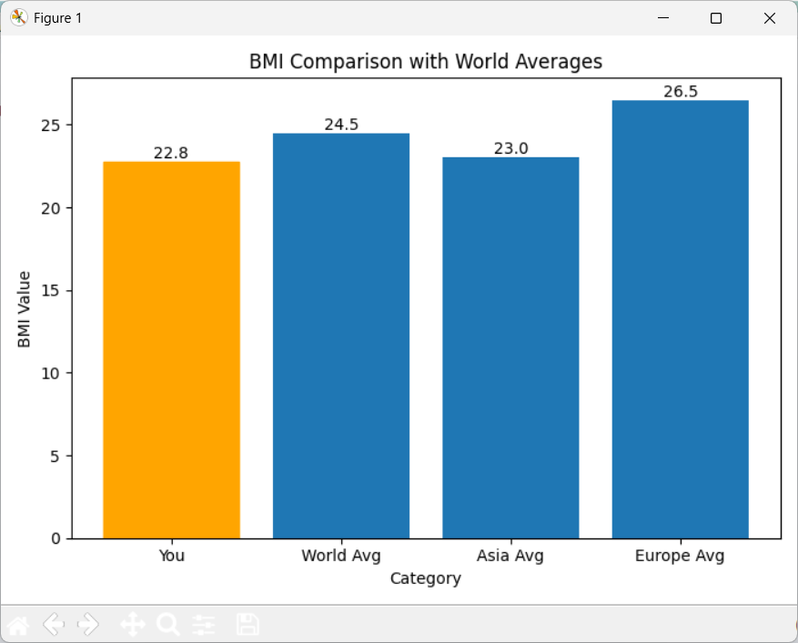

**Weight vs healthy range graph**  
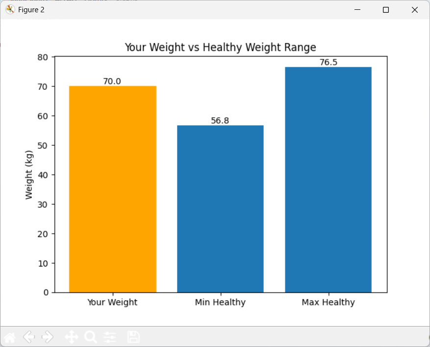

**BMI position on scale**  
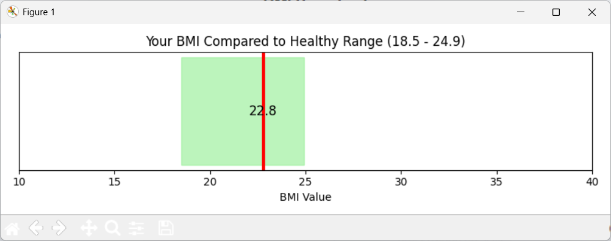

**Global BMI distribution chart**  
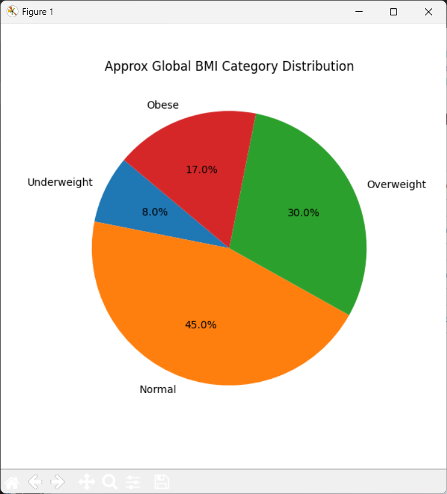

---

## 🛠️ Development

### Adding New Features

1. **New Calculation** - Add to [`bmi_core.py`](src/bmi_core.py)
2. **New Visualization** - Add to [`visualize.py`](src/visualize.py)
3. **New Static Suggestions** - Update [`suggestions.py`](src/suggestions.py)
4. **AI Behavior Changes** - Modify system instructions in [`chatbot_ai.py`](src/chatbot_ai.py)

### Code Style
- Follow PEP 8 guidelines
- Use type hints where applicable
- Document functions with docstrings

---

## ⚠️ Disclaimer

This application is for **educational and informational purposes only**. It is not a substitute for professional medical advice, diagnosis, or treatment. Always consult with a qualified healthcare provider for health-related decisions.

---

## 📄 License

This project is licensed under the MIT License - see the [LICENSE](LICENSE) file for details.

---

## 👤 Project Team

**Arham Ahmed Khan**
- GitHub: [@aak1767](https://github.com/aak1767)
- SRN: PES1UG25CS090

**Aadhya**
- SRN: PES1UG25CS004

**Anshuman H Singh**
- SRN: PES1UG25AM047

**Chetan N Goudar**
- SRN: PES1UG25CS139

---

## 🙏 Acknowledgments

- World Health Organization (WHO) for BMI classification standards
- Google for Gemini AI API
- wxPython and Matplotlib communities